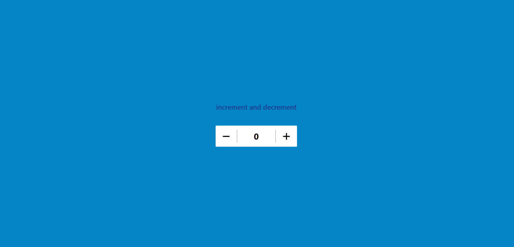

# Plus and Minus Counter Application

The Plus and Minus Counter Application is a simple web-based utility that allows users to increment or decrement a counter value using buttons.



## Table of Contents

- [Description](#description)
- [Usage](#usage)
- [Technologies Used](#technologies-used)
- [How to Run](#how-to-run)
- [Contributing](#contributing)
- [License](#license)

## Description

The Plus and Minus Counter Application is designed to demonstrate the basic functionality of incrementing and decrementing a counter. The application provides buttons to increase or decrease the counter value, and the current counter value is displayed on the screen.

## Usage

1. Open the application in a web browser.

2. Click the "+" button to increment the counter.

3. Click the "-" button to decrement the counter.

4. The current counter value is displayed on the screen.

## Technologies Used

- HTML
- Tailwind CSS
- FontAwesome icons
- JavaScript

## How to Run

1. Clone or download this repository.

2. Open the `index.html` file in a web browser.

3. Use the "+" and "-" buttons to increment or decrement the counter value.

## Contributing

Contributions are welcome! If you have suggestions, improvements, or bug fixes, please submit a pull request.

1. Fork the repository.

2. Create a new branch:

   ```bash
   git checkout -b feature/your-feature-name
